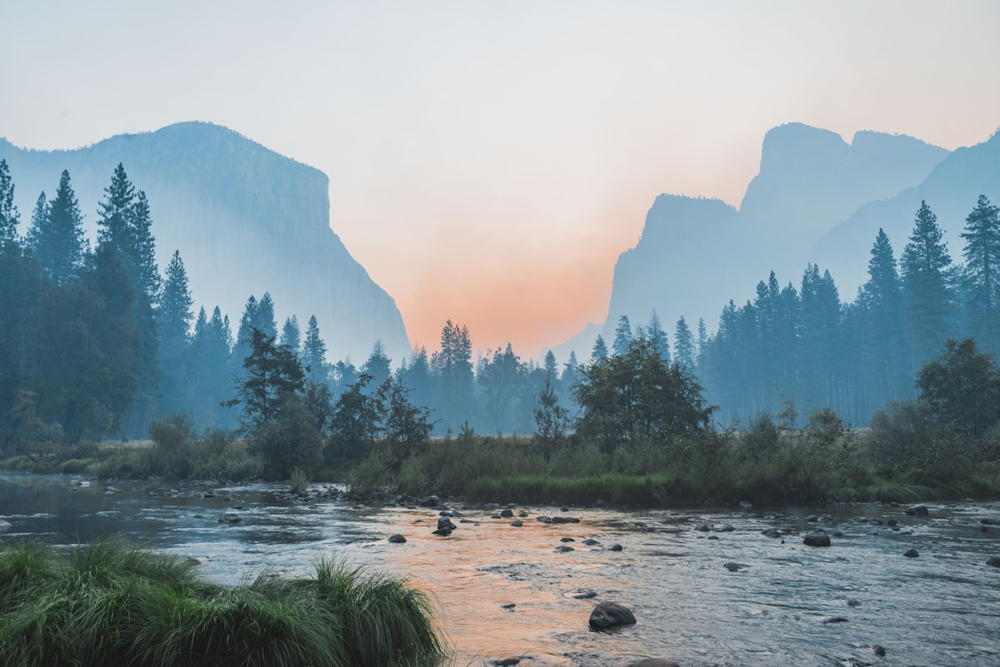

# Terminal-Themed Portfolio

A modern, minimal, and highly customizable portfolio built with Next.js 15, inspired by terminal emulators and fastfetch/neofetch output. Designed for developers who love the terminal aesthetic and want to showcase their work, skills, and contact info in a unique way.



## ✨ Features
- **Terminal-inspired UI:** Catppuccin/Mocha color palette, monospace font, and command-line style headers.
- **Responsive design:** Looks great on all devices.
- **Animated section headers:** Each page uses a terminal command (e.g., `>>> whoami`, `>>> ls projects`).
- **About section:** Fastfetch-style info panel with your picture, skills, hobbies, languages, and activities.
- **Projects:** Showcases your work with custom cards and icons.
- **Contact:** Stylish cards for LinkedIn, GitHub, and email.
- **Active navbar highlighting:** Always know which section you're in.
- **Easy customization:** All content and theme colors are easy to update.

## 🛠️ Tech Stack
- [Next.js 15 (App Router)](https://nextjs.org/)
- [React 19](https://react.dev/)
- [TypeScript](https://www.typescriptlang.org/)
- [react-icons](https://react-icons.github.io/react-icons/)
- [Catppuccin/Mocha palette](https://catppuccin.com/)

## 🚀 Getting Started

1. **Clone the repo:**
   ```bash
   git clone https://github.com/your-username/your-portfolio.git
   cd your-portfolio
   ```
2. **Install dependencies:**
   ```bash
   npm install
   # or
   yarn install
   ```
3. **Run the dev server:**
   ```bash
   npm run dev
   # or
   yarn dev
   ```
4. **Open [http://localhost:3000](http://localhost:3000) in your browser.**

## 🖌️ Customization
- **Profile picture:** Replace `public/images/myPic.png` with your own.
- **About info:** Edit `src/app/about/page.tsx` for your name, description, skills, hobbies, and activities.
- **Projects:** Edit `src/app/projects/page.tsx` to add your own projects.
- **Contact:** Edit `src/app/contact/page.tsx` for your LinkedIn, GitHub, and email.
- **Theme colors:** Tweak `src/styles/theme.css` for your favorite terminal palette.
- **Background:** Replace `public/forest-bg.jpg` for a custom background.

## 📦 Build for Production
```bash
npm run build
npm start
```

## 📬 Contact
- **LinkedIn:** [hamza-alaoui-mhamdi](https://www.linkedin.com/in/hamza-alaoui-mhamdi)
- **GitHub:** [hamza-rx12](https://github.com/hamza-rx12/)
- **Email:** alaoui.hamza2002@gmail.com

---

> Inspired by fastfetch, neofetch, and the Catppuccin/Mocha terminal theme.
